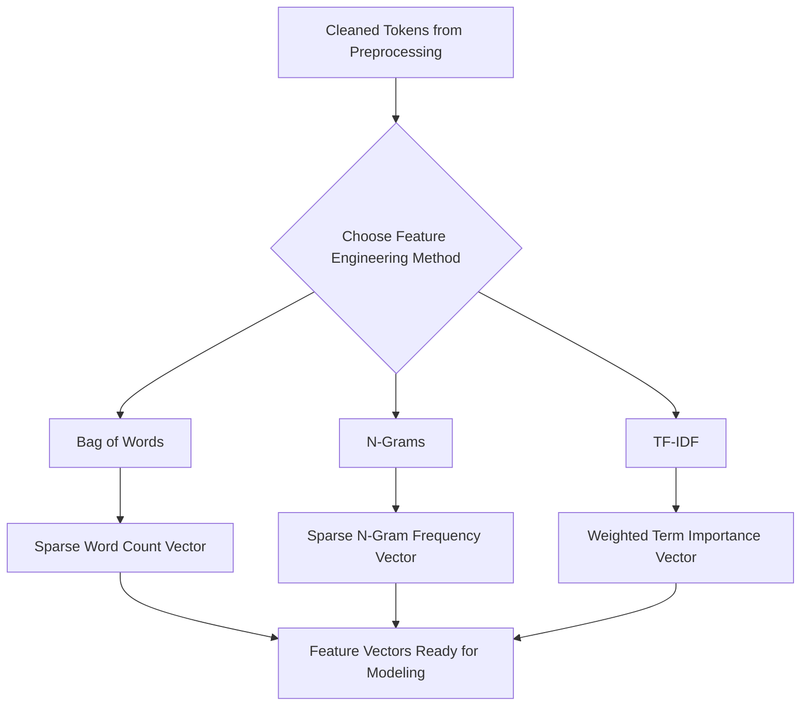

# Workflow Diagram: Feature Engineering Pipeline

**Contributor:** [Partner's Name]

## Diagram

## Explanation of Each Stage

1. **Cleaned Tokens** — The output from the Text Preprocessing Pipeline (tokenized, normalized, stop-words removed, stemmed/lemmatized text).
2. **Bag of Words** — Represents text as a vector of word counts, ignoring grammar and word order, treating each document as an unordered collection of words.
3. **N-Grams** — Extends Bag of Words by capturing sequences of N consecutive words (e.g., bigrams, trigrams) instead of single words, preserving some local word order and context.
4. **TF-IDF** — Weighs each word by how important it is to a specific document relative to the whole corpus, downweighting common words and upweighting distinctive ones.
5. **Feature Vectors** — The final numerical output from any of these methods, ready to be passed into a machine learning model for tasks like classification or clustering.

## How This Connects to the Preprocessing Pipeline
This pipeline picks up exactly where the Text Preprocessing Pipeline (Section C, Preprocessing Pipeline diagram) leaves off. Clean, normalized tokens are the required input here — running feature engineering on raw, unprocessed text would produce noisy, unreliable features (e.g., "Bank" and "bank" being counted as different words).
