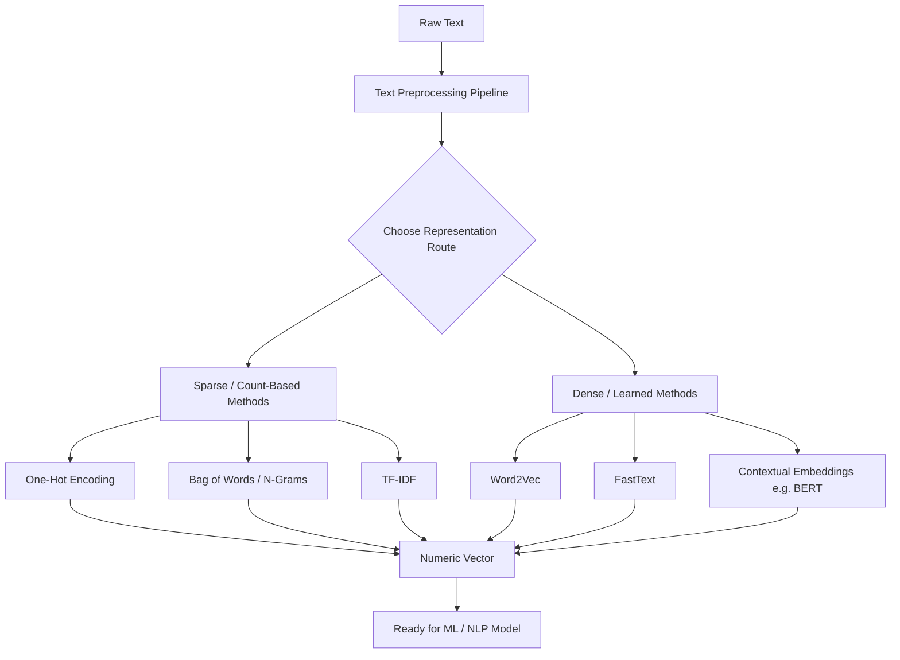

# Workflow Diagram: Text-to-Vector Transformation Process

**Contributors:** Sneha & Mahek

## Diagram

## Explanation of Each Stage

1. **Raw Text** — The original, unprocessed input (a sentence, review, complaint, document, etc.).
2. **Text Preprocessing Pipeline** — Tokenization, normalization, stop-word removal, and stemming/lemmatization (see the dedicated Preprocessing Pipeline diagram in this repository for detail).
3. **Choose Representation Route** — Once text is clean, a system picks between two broad families of representation:
   - **Sparse / count-based methods**, which are simple, fast, and interpretable, but treat words as unrelated symbols.
   - **Dense / learned methods**, which require more compute but capture semantic meaning and similarity between words.
4. **Sparse branch** — One-Hot Encoding, Bag of Words / N-Grams, and TF-IDF all fall here; each produces a large, mostly-zero vector.
5. **Dense branch** — Word2Vec and FastText produce fixed embeddings per word (or subword), while contextual embedding models like BERT generate a different vector for the same word depending on its sentence context.
6. **Numeric Vector** — Regardless of route, the end result is always a vector (or matrix) of numbers — this is the only format a machine learning model can actually consume.
7. **Ready for ML / NLP Model** — These vectors become the direct input to downstream tasks: classification, clustering, translation, sentiment scoring, and so on.

## Why This Diagram Matters
This is the "big picture" view that ties the other two workflow diagrams together: the Preprocessing Pipeline explains stage 2 in detail, the Feature Engineering Pipeline expands on the sparse branch, and the Concept Cards for Word2Vec/FastText/Embeddings explain the dense branch. Seeing all of it as one connected path — from a raw sentence to a number a model can use — makes it clear *why* every earlier concept in this repository exists: they are each just a different way of answering the same question, "how do we turn text into numbers without losing meaning?"
